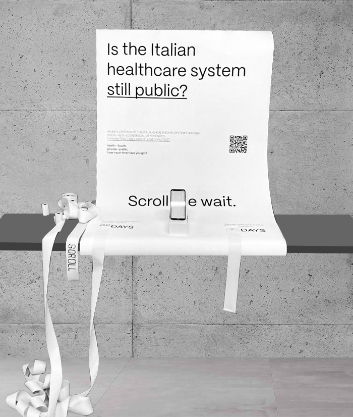
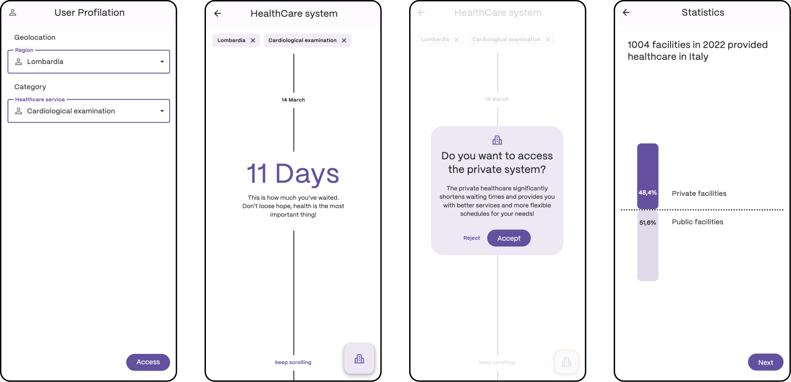

# Scroll
Is the public healthcare system still public?
###### ABSTRACT
Scroll is a project developed in a week-long workshop. It deals with the issue of healthcare system privatization.
The focus is on the inequity of waiting times: the latter were made tangible through an app (with the frustrating action of time scrolling) and a subsequent printout of the time elapsed.

  

###### OVERVIEW

  

